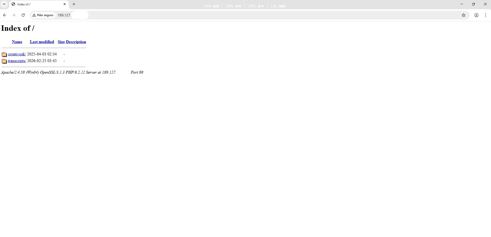

## 🔐 Attack Surface Analysis
🚀 Projeto prático de análise de superfície de ataque utilizando Nmap
## 📌 Descrição

Este projeto documenta uma análise inicial de reconhecimento (reconhecimento de rede) em um servidor web exposto, com foco na identificação de serviços ativos e possíveis riscos de segurança.

 ⚠️ Observação: O endereço IP foi parcialmente anonimizado por questões éticas. Nenhuma tentativa de exploração ou acesso não autorizado foi realizada.

 ## 🛠️ Ferramentas Utilizadas
- Nmap (enumeração de portas e serviços)
- Navegador web (análise manual)
## 🔎 Enumeração de Serviços

Comando utilizado:

nmap -sV --version-all -Pn -n 189.127.[redacted]
## 📊 Resultado (adaptado):

| PORT     | STATE | SERVICE | VERSION                          |
|----------|------|--------|----------------------------------|
| 22/tcp   | open | ssh    | OpenSSH (Windows)               |
| 80/tcp   | open | http   | Apache (PHP)                    |
| 443/tcp  | open | https  | Apache (PHP)                    |
| 3306/tcp | open | mysql  | MariaDB (unauthorized)          |
| 3389/tcp | open | rdp    | Microsoft Terminal Services     |

**Service Info:** OS: Windows

## 🌐 Análise Web

Ao acessar o servidor via navegador:

- Directory Listing habilitado
- Servidor Apache em ambiente Windows
- Uso de PHP no backend
## 📂 Diretórios expostos:
- /creativezk/
- /transcripts/

## ⚠️ Possíveis Riscos Identificados
- Exposição de arquivos sensíveis via directory listing
- Serviços críticos expostos publicamente:
> - SSH (acesso remoto)
> - RDP (acesso remoto gráfico)
> - Banco de dados (MySQL/MariaDB)
- Possível risco de autenticação fraca
- Superfície de ataque ampliada
## 🧠 Interpretação

Foi identificado um servidor com múltiplos serviços expostos à internet, incluindo acesso remoto e banco de dados.

A presença de directory listing indica possível falha de configuração, podendo permitir acesso não intencional a arquivos internos.

## 📚 Aprendizados
- Uso do Nmap para enumeração de serviços
- Identificação de tecnologias web
- Análise de exposição de diretórios
- Entendimento de superfície de ataque
## ⚖️ Aviso Legal

Este projeto foi realizado exclusivamente para fins educacionais.
Nenhuma tentativa de exploração, invasão ou acesso não autorizado foi executada.

Todas as informações foram tratadas de forma ética e responsável.
